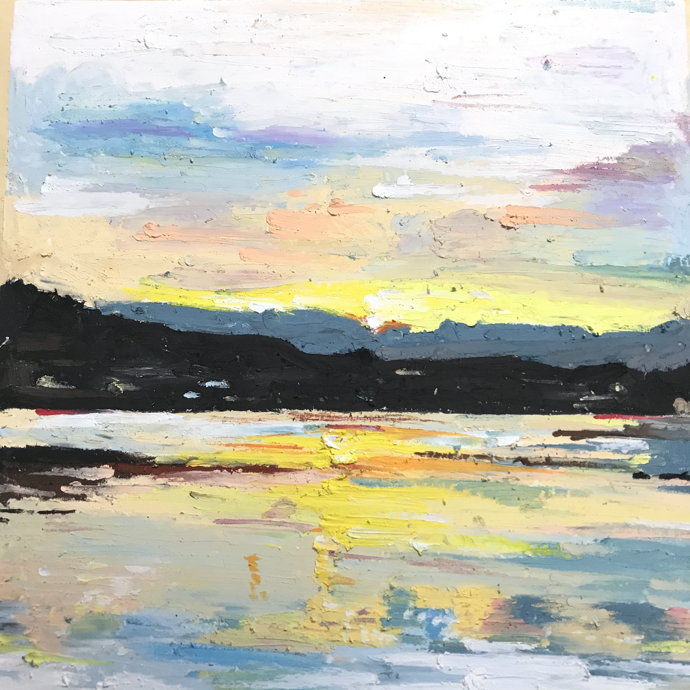
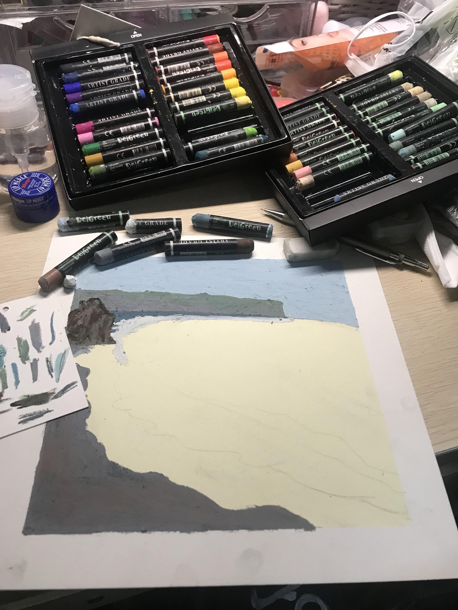

# Gallery: An Online Exhibition of Paintings
This web page is intended to provide an online mini solo-exhibition of a series of paintings created by Miss
**_Yaqin Feng_**, a third-year student majoring in
**Art Design** at **[Hubei Institute of Fine Arts](http://www.hifa.edu.cn/zy.htm)**, Wuhan, China.

## Contact information
Please feel free if any ideas and inspirations that exchange with Miss **_Yaqin Feng_**.

## What's shared to the public
For many times, she would like to sort out artworks that she has been created up to now and then open them to other
colleagues and fellows in the art communities who are committed to pursuing  perfection on Art. Each artwork is 
behind an attractive and particular story. Her artworks are no more than paintings themselves but vivid stories.
 
## Artwork collection
+ ### _Sunset Upon Hill_

 #### The story behind artwork - _Sunset Upon Hill_
 In fall semester 2019, Miss **_Yaqin Feng_** had a short study tour to Yunan, 
 a southwestern Province of China. The painting depicts a typical 
 landscape scenery of **Changshan Mountain** as seen from **Erhai Lake**, 
 which is  a famous sightseeing spot of the city Dali in Yunan Province.
 
  
 Life rhythm in Dali is comfortable and quite. 
 This is what the painting wants to implicate. As winds slightly crossed over
 forests in the mountain,  a sunset was glowing fantastic sunshine, 
 flowing into the peaceful lake from the top of Changshan Mountain. 
 _The meaning behind the painting is harmony between human beings and nature_.

## Snapshot of several ongoing artworks
